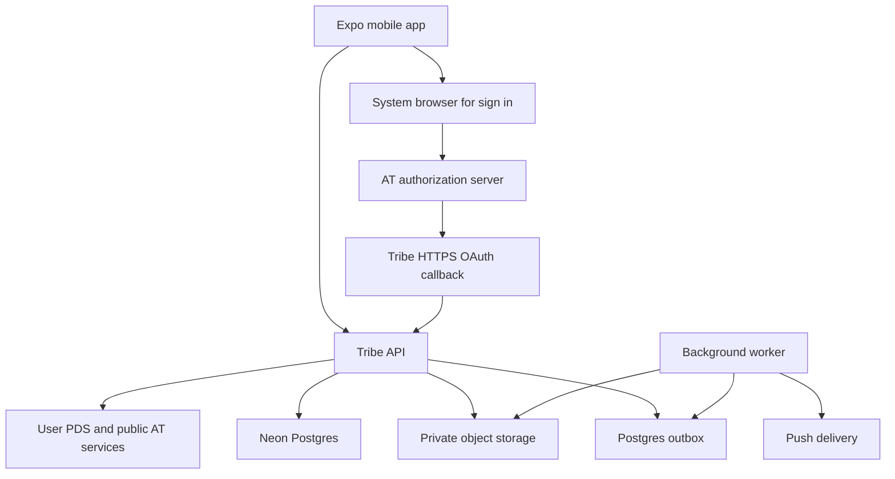

# Tribe architecture and repository replacement plan

Original implementation plan · October 7, 2026

The rebuild has now been implemented on `rebuild/expo-neon`. Final runtime choices are recorded in [the implementation decision](decisions/001-neon-runtime.md), and completed checks in [verification](operations/VERIFICATION.md). The infrastructure recommendations below preserve the original planning context.

Build a fresh Expo application and a small TypeScript backend backed by Neon Postgres. Use AT Protocol for verified identity and public interoperability. Enforce private Tribe sharing through the backend and private object storage. Replace the implementation in the existing [Erics1337/tribe repository](https://github.com/Erics1337/tribe) through normal branches and pull requests, retaining history and a recoverable legacy snapshot.

The [product requirements](./PRD.md) define the intended experience. This plan describes how to deliver it. It does not authorize deletion of the existing repository or imply that a replacement has already been pushed.

## What the old project tells us

Local review of `/Users/ericswanson/code/tribe-old` found a clean working tree at commit `6874ba8`, with origin pointing to `https://github.com/Erics1337/tribe.git`. `/Users/ericswanson/code/tribe` was empty before these documents were created. Local origin configuration identifies the intended repository; verify the current remote default branch and deployed state when implementation begins.

The legacy project already uses an Expo Router mobile app, Fastify, Drizzle, shared TypeScript validation, AT OAuth, private recipient rows and a product draft. Its README proposes Supabase for managed database and storage. Preserve the ideas and integration lessons, then implement against the new requirements.

| Legacy element                                           | Rebuild treatment                                                                             |
| -------------------------------------------------------- | --------------------------------------------------------------------------------------------- |
| Product story and calm sharing goals                     | Preserve; tighten privacy and science claims                                                  |
| OAuth metadata, redirects and native-build lessons       | Use as references; validate against current official SDK guidance                             |
| Expo, TypeScript, shared validation, Fastify and Drizzle | Retain as stack choices where useful; write fresh application modules                         |
| Circle domain helpers                                    | Rewrite for nested capacities; old helpers use separate tier counts and exact-tier recipients |
| Recipient snapshot concept                               | Preserve concept; add revocation and comprehensive authorization                              |
| Identity-to-session exchange                             | Rewrite; old identity verifier checks a DID prefix without proving ownership                  |
| Demo sign-in, seeded data and permissive defaults        | Confine fixtures to tests and explicit local tooling                                          |
| Current schema and migration approach                    | Replace with versioned migrations, foreign keys, checks and clear lifecycle rules             |
| Visual implementation                                    | Treat as context; design new screens around actual relationship tasks                         |

This is a focused reference review, not a complete security audit of the old application.

## Recommended architecture



### Stack decisions

| Layer       | Proposed choice                                                            | Purpose                                                                |
| ----------- | -------------------------------------------------------------------------- | ---------------------------------------------------------------------- |
| Mobile      | Expo, React Native, Expo Router, TypeScript                                | Shared iOS and Android client                                          |
| Client data | TanStack Query; small local state store; SecureStore for app credentials   | Server state, drafts and secure sessions                               |
| API         | Fastify on a managed Node container                                        | Straightforward transactions, OAuth callbacks and private API          |
| Database    | Neon Postgres, Drizzle migrations, `pg`                                    | Relational graph, grants, transactional capacity enforcement           |
| Identity    | Official AT OAuth Node SDK behind a protocol adapter                       | Server-verified login and optional later public writes                 |
| Media       | Private S3-compatible object storage; initial recommendation Cloudflare R2 | Private photos outside public PDS blobs                                |
| Worker      | Separate process from the same codebase; Postgres outbox                   | Media processing, notification delivery, exports and cleanup           |
| Delivery    | EAS development and release builds, GitHub Actions                         | Native testing, reproducible builds and deployment checks              |
| Hosting     | Initial recommendation a managed container platform such as Render         | API and worker processes; finalize region and cost before provisioning |

These are proposed infrastructure choices, not purchased resources or cost quotations. Put the API near the Neon region. Use pooled database connections for application traffic and a direct connection for migrations where required. Confirm current plan limits and operating costs before provisioning. Database branching can support isolated development and preview environments; populate these with synthetic data rather than real private circles. See [Neon branching workflows](https://neon.com/branching).

Use development builds from the beginning for representative native behavior. Expo documents the distinction between Expo Go and a customizable development build. See [Expo development builds](https://docs.expo.dev/develop/development-builds/introduction/).

Start with a modular backend, not independent microservices. Do not self-host a PDS or relay, build a full AppView, or add a separate queue and search cluster for the beta.

### Repository structure

```text
apps/
  mobile/                 Expo app and screens
  api/                    HTTP API, OAuth callback and domain services
  worker/                 Background processing
packages/
  domain/                 Circle and sharing rules
  contracts/              Request and response validation
  db/                     Schema, migrations and repositories
  atproto/                OAuth and public-network adapter
  ui/                     Mobile design tokens and reusable controls
docs/
  PRD.md
  REBUILD_PLAN.md
  decisions/              Short architecture decisions
  operations/             Release, incident and recovery procedures
```

Use pnpm workspaces and a single lockfile. Add a build orchestrator only if workspace scripts become insufficient. Pin compatible current releases during bootstrap rather than copying old package versions.

## Authentication boundary

AT OAuth supports server-side and native clients, requires PKCE and DPoP, and uses hosted client metadata. Account identity is verified through the OAuth token response's subject. Official libraries provide protocol-specific flow handling. See [OAuth specification](https://atproto.com/specs/oauth) and [SDK patterns](https://atproto.com/guides/about-oauth).

Recommended initial implementation: a backend-owned confidential OAuth client. The mobile app opens a system-browser login, the PDS redirects to Tribe's registered HTTPS callback, and the server completes OAuth. This makes the backend the authority that has verified the DID, avoiding an improvised exchange of a mobile-provided identity payload.

1. Mobile generates a verifier and submits its challenge when starting login. The server creates an expiring login transaction with OAuth state and the expected app callback from a fixed allowlist.
2. The SDK handles discovery, authorization, PKCE, DPoP and token validation. Verify returned identity and bind it to the original transaction. Restrict discovery fetches against SSRF, including redirects and private network addresses.
3. The HTTPS callback creates a short-lived, single-use completion code bound to the mobile challenge. Redirect to an app link containing only that code. Mobile redeems it with its verifier.
4. Issue a short-lived Tribe access token and rotating opaque refresh token. Store refresh-token hashes and revoke sessions on replay, logout or account deletion. Keep server-held AT credentials encrypted with a separately managed key.
5. Resolve mutable handles and public profile data separately from the stable DID. Profile fetch failures must not allow identity substitution or prevent a verified account from using a cached profile.

The mobile completion challenge is separate from the OAuth SDK's PKCE verifier. Never put Tribe or AT access tokens in callback URLs or logs. Request minimal scopes for login and public reads; add write permission only when the user enables a concrete public publishing feature.

The official Expo OAuth SDK remains an alternative if later requirements favor direct client-side PDS operations. Do not implement both flows initially. Authentication is the first feasibility spike: test the backend-to-app return flow on real iOS and Android builds and at least two PDS hosts before building the rest of the product around it.

## Data model and invariants

| Entity                   | Essential fields and rules                                                                                             |
| ------------------------ | ---------------------------------------------------------------------------------------------------------------------- |
| Users                    | Internal ID, unique DID, cached handle/profile, lifecycle state; handle is mutable and not the identity key            |
| Connections              | Owner ID, target DID, closest tier, state; unique owner/target; private to owner; target may not yet have a Tribe user |
| Posts                    | Author ID, body, private audience choice, creation time, deletion state, audience version                              |
| Post grants              | Post ID, recipient DID, issued time, revocation time; unique post/recipient; deny removed grants permanently           |
| Media assets             | Owner, private object key, upload/processing state, dimensions, alt text; association to a post only after validation  |
| Comments and reactions   | Post and actor foreign keys; one reaction per actor/post; permission inherited from parent post                        |
| Blocks and mutes         | Directed pairs with unique constraints; blocks checked in both directions                                              |
| Sessions and OAuth state | Expiry, encrypted AT state, hashed refresh credentials and one-time completion records                                 |
| Notifications and outbox | Minimal event payload, recipient, idempotency key, delivery/retry state                                                |
| Reports and audit events | Restricted evidence snapshot, reason, review status and staff access trail                                             |
| Invitations and exports  | Expiring opaque references; no embedded circle assignments or unprotected files                                        |

Use foreign keys, valid-tier checks, uniqueness constraints and indexes for recipient feed lookup, author chronology and owner connection counts. Count nested membership using tier ordering, not four independent counts.

For graph mutations, lock a persistent owner row inside a transaction, check nested counts, then write the assignment. Every graph writer uses the same lock, including account registration transitions and administrative repairs. Posting takes that owner lock too: compare the preview version, compute active registered recipients, and commit post, grants and outbox together. Use consistent lock ordering for multi-user operations to avoid deadlocks.

Centralize a `canViewPost(viewer, post)` policy: active viewer and author, active post, author ownership or unrevoked grant, and no block in either direction. Muting affects feed selection only. Relationship removal and blocking update grants transactionally; check blocks dynamically as an additional denial. Comments, media and queued delivery reuse the same policy.

An author may see their own post after removing recipients. A reported post can be retained in a separate, restricted evidence store according to the disclosed retention policy; this must not keep the user-facing post accessible.

All database access goes through the server. RLS can provide additional protection if configured with a non-bypass role and transaction-local identity, but does not replace tested application policy. Never expose Neon credentials to Expo.

## Private media and public interoperability

Uploads use short-lived author-bound upload permissions into a private quarantine prefix. On completion, validate size, signature and dimensions; strip EXIF metadata; generate thumbnails; finalize the asset. Delete orphaned uploads on a schedule. Associate only assets owned by the posting user.

For beta, deliver private media through an authenticated gateway that checks the current post policy and streams the object. Avoid public bucket URLs and reusable long-lived download links. Return private cache directives and keep authenticated media caches account-scoped. If signed downloads are introduced later, disclose the revocation window and specify a short expiry; immediate revocation cannot be promised for a still-valid bearer URL.

An AT custom Lexicon defines schemas; it does not add private access control to a public record. Use typed, versioned internal records so that a future protocol privacy layer can be integrated through an adapter. Do not write circle assignments, recipients, private posts or private photo blobs to public repositories. See [Lexicon guide](https://atproto.com/guides/lexicon) and [public reads and writes](https://atproto.com/guides/reads-and-writes).

The public Network beta surface reads existing public profiles and selected authors' public posts through public AT services. Cache conservatively, honor source deletion and moderation, and label cached stale results during outages. It can degrade independently of private sharing. Import follows only when requested, as suggestions.

Later public publishing should initially use existing interoperable `app.bsky` records within their then-current content limits, rather than assuming a new photo Lexicon will render in Bluesky. Track publication URI, CID, status, idempotency and deletion separately. Tell users that deleting the source cannot retrieve copies retained elsewhere.

Export private user-owned content, assignments and media in a documented archive. Exclude others' private assignments and grants; define treatment of received posts and comments explicitly. Private export is not automatic federation or complete backend portability. A PDS move under the same DID should preserve the Tribe account after OAuth rediscovery.

## Delivery sequence

Estimate: approximately 10–14 engineering weeks for one experienced full-time developer, with design and security-review support. This is a planning range, not a delivery commitment. OAuth, media and two-platform testing may change it; do not schedule a public launch before the beta produces evidence.

| Phase                              | Indicative effort | Work                                                                                                                       | Exit gate                                                                         |
| ---------------------------------- | ----------------- | -------------------------------------------------------------------------------------------------------------------------- | --------------------------------------------------------------------------------- |
| 0 Product decisions and prototype  | 1 week            | Confirm nested circles and revocation; prototype onboarding, capacity and audience preview; interview prospective networks | Users can explain recipient selection and circle privacy                          |
| 1 Foundation and identity          | 1–2 weeks         | Fresh workspace, CI, Neon dev setup, migrations, server OAuth, real-device builds                                          | Two-PDS sign-in, renew, revoke, logout and changed-handle cases pass              |
| 2 Circles and authorization        | 2 weeks           | Connections, nested caps, blocks, grants, recipient preview and private post policy                                        | Concurrent cap tests and cross-account access tests pass                          |
| 3 Complete sharing loop            | 2–3 weeks         | Private photos, composer, feed, comments, reactions, media gateway and retry behavior                                      | Friends can share and catch up on both platforms; revocation covers every surface |
| 4 Safety and operational readiness | 2 weeks           | Reporting, staff review, deletion, exports, jobs, push controls, monitoring and recovery                                   | Restore drill, export review and abuse workflow complete                          |
| 5 Closed beta and stabilization    | 2–4 weeks elapsed | Recruit networks, run cohort, fix friction and failures; optional public Network work if ready                             | Product thresholds assessed; privacy gate passes; rollout decision documented     |

Beta observation can overlap the final engineering work after the safe core is ready. The public Network reader should be feature-flagged and can follow the first private-sharing cohort; it must be ready before calling the full scoped beta complete. Public posting and AI are outside this schedule.

The first implementation milestone is deliberately concrete: Alice and Bob sign in with verified DIDs; Alice puts Bob in Inner; Alice posts a photo; Bob can view and comment; Charlie cannot fetch the post or media; Alice removes Bob and all future private access fails.

## Verification gates

- Unit tests for nested counts, moves, grants and audience-preview versions.
- Postgres integration tests for transactions, concurrent capacity mutations, post/recipient atomicity and idempotency.
- Negative authorization tests for unrelated users across lists, direct object IDs, comments, reactions, media, notifications and exports.
- Regression tests for adding, moving, removing, re-adding, blocking, unblocking, deletion and account lifecycle transitions.
- OAuth tests for replayed state/completion codes, DID spoofing, callback mismatch, expired sessions, PDS migration and unavailable discovery services.
- Real-device flows on iOS and Android for sign-in, upload cancellation, app restart, deep links, denied photo permission, logout and offline drafts.
- Accessibility review of the primary journeys, and load measurements against the stated beta targets.
- Restore a database backup and recover associated media in staging; document what database branching does not restore.

CI runs linting, type checks, domain tests, integration tests, migration validation and relevant mobile build checks. No production demo-login endpoints or seeded real-account fixtures. Restrict telemetry and inspect logs for private content before inviting users.

## Replacing the existing GitHub implementation

### Preserve and isolate

1. Fetch current remote refs and confirm the repository's default branch, branch protections, secrets, deployment hooks and actual user data. Do not assume the local legacy commit is the latest GitHub state.
2. Preserve the current remote default-branch commit with an annotated legacy tag and a protected legacy branch. Record a local Git bundle or verified remote recovery reference. Separately inventory ignored configuration and live database/media; Git history does not back them up.
3. Clone the existing repository into `/Users/ericswanson/code/tribe` using a temporary sibling directory so the planning documents are not overwritten. Incorporate these documents into that checkout. Create a normal rebuild branch from the verified remote default branch.
4. Develop the replacement with legacy code retained initially under an isolated path, or remove it in the first replacement commit once its recovery reference is verified. New code must build without importing the legacy app.

### Review and switch

5. Land a sequence of reviewable changes: planning and scaffold; verified identity; circle domain and policy; complete private sharing; operational readiness. Use one integration branch if partially delivered code would disrupt an existing deployment.
6. Use separate preview infrastructure, database, media and OAuth metadata. Disable automatic production deployment for unfinished rebuild commits. Branch protection and required checks remain meaningful throughout the rebuild.
7. Inventory whether the legacy deployment has real users. If it is a prototype, use a fresh database after preserving relevant data. If it has users, produce a DID-based migration and communications plan. Require users to review old independent tier assignments because they do not map automatically into nested caps; retain old private content behind its original grants until an explicit migration rule is tested.
8. Prepare the final replacement PR: explain the behavioral changes, show real mobile flows, attach verification results, and document infrastructure, data migration and rollback. Remove abandoned dependencies, fixtures and legacy build scripts from the active implementation.
9. Merge the reviewed replacement into the existing default branch. Keep the repository URL, issues and history. Deploy only after the release gates are satisfied; rotate credentials where warranted and retain a tested rollback path.

Do not force-push a new unrelated history, delete the GitHub repository, or rename the existing default branch simply to make the rewrite feel fresh. Keep release tags and ensure old mobile clients cannot access new endpoints through an incompatible authentication model.

Rollback must include API/mobile compatibility and database state. Prefer additive migrations during initial rollout. A Git revert alone cannot undo destructive data changes or retrieve already distributed app builds. Before cutover, define how to pause writes, roll the API back, restore data when necessary, and communicate an interruption to beta users.

## Remaining founder decisions

The PRD proposes workable defaults. The highest-value review items are the strict nested caps, historical revocation on removal, launching to existing AT account holders, and the role of the separate public Network surface. Hosting region, media provider and budget can be finalized during foundation work. Account creation for a wider audience and public publishing deserve their own specifications before implementation.
